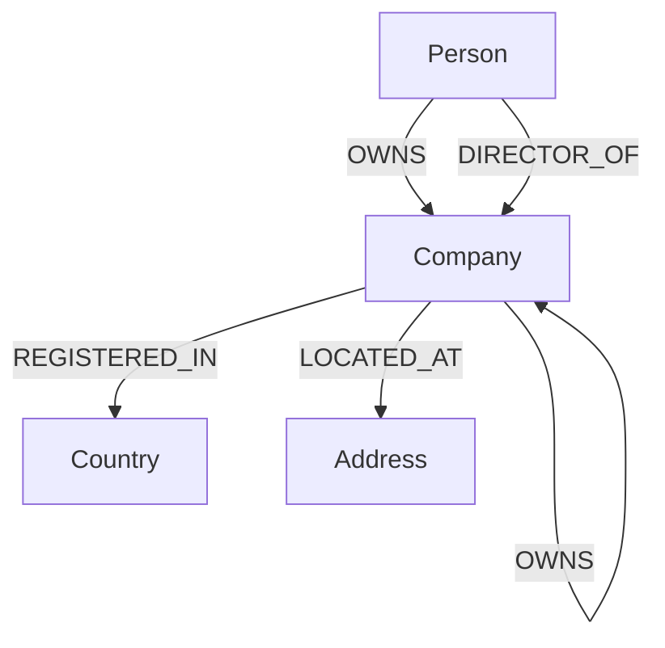

# GraphLens — Corporate Relationship Investigation Tool

GraphLens is a corporate relationship investigation web application built with **React**, **Node.js/Express**, and **CognoDB** (using the official `neo4j-driver` and openCypher).

It helps investigators and developers explore complex corporate ownership structures, trace multi-hop parent/subsidiary chains, discover shared address shell clusters, and detect offshore tax haven linkages.

---

## Key Features

* **Overview Dashboard**: Graph database statistics (Companies, People, Countries, Addresses, Relationships) and key risk indicators.
* **Entity Explorer**: Search companies and individuals by name with parameter binding, filter by type, and view direct relationships in a detail side panel.
* **Relationship Traversal**: Execute multi-hop Cypher path traversals (`Person → Company → Company → Company`) with effective ownership calculations and interactive `vis-network` graph canvas.
* **Risk Checks**: Graph-derived risk identification flagging offshore tax haven connections, shared address congestion, and shared directorship networks.
* **Error Resilience**: User-friendly database error handling when CognoDB is offline with retry buttons and clean loading/empty states.

---

## Why a Graph Database?

In corporate investigations, the primary data asset is **relationships**.

For example, an individual may own Company A, which owns Company B, which in turn owns Company C:

```text
Elena Vance (Person)
   │
   ├─► OWNS (100%) ──► Apex Capital
                         │
                         ├─► OWNS (60%) ──► Meridian Energy
                                               │
                                               └─► OWNS (45%) ──► Nova Logistics
```

### Why SQL is Awkward for This Use Case

1. **Multi-Hop Traversal (Variable-Length Paths)**:
   In a relational database (SQL), tracing an ownership chain across an unknown number of holding companies requires writing complex, performance-heavy recursive Common Table Expressions (CTEs). In openCypher, variable-length path traversal is expressed naturally:
   ```cypher
   MATCH path = (source {id: $sourceId})-[:OWNS*1..4]->(target:Company {id: $targetId})
   RETURN path LIMIT 10
   ```

2. **Shared Asset & Director Discovery**:
   Identifying shell companies that share the exact same physical address or board director requires multiple self-joins and `GROUP BY` aggregations in SQL. In a graph database, pattern matching naturally highlights shared nodes:
   ```cypher
   MATCH (c1:Company)-[:LOCATED_AT]->(a:Address)<-[:LOCATED_AT]-(c2:Company)
   WHERE c1.id < c2.id
   RETURN a.fullAddress AS address, c1.name AS company1, c2.name AS company2
   ```

---

## Data Model

GraphLens uses a clean, typed graph model centered around corporate connections.



### Nodes

* **`Company`**: `id`, `name`, `registrationNumber`, `incorporationDate`, `riskScore`
* **`Person`**: `id`, `name`, `nationality`, `riskScore`
* **`Country`**: `id`, `name`, `isTaxHaven` (boolean)
* **`Address`**: `id`, `fullAddress`

### Relationships

| Relationship | From | To | Properties |
| :--- | :--- | :--- | :--- |
| `OWNS` | Person / Company | Company | `ownershipPercentage` (Float) |
| `DIRECTOR_OF` | Person | Company | — |
| `REGISTERED_IN` | Company | Country | — |
| `LOCATED_AT` | Company | Address | — |

---

## Important Cypher Queries

All queries use parameter binding via the official `neo4j-driver` to ensure security.

### 1. Dashboard Statistics
```cypher
MATCH (c:Company) WITH count(c) AS companies
MATCH (p:Person) WITH companies, count(p) AS people
MATCH (co:Country) WITH companies, people, count(co) AS countries
MATCH (a:Address) WITH companies, people, countries, count(a) AS addresses
MATCH ()-[r]->() WITH companies, people, countries, addresses, count(r) AS relationships
MATCH (e) WHERE (e:Company OR e:Person) AND e.riskScore >= 70
RETURN companies, people, countries, addresses, relationships, count(e) AS highRiskCount
```

### 2. Entity Search ($search)
```cypher
MATCH (e)
WHERE (e:Company OR e:Person) AND ($search = '' OR toLower(e.name) CONTAINS toLower($search))
OPTIONAL MATCH (e)-[:REGISTERED_IN]->(co:Country)
RETURN e, labels(e)[0] AS type, co.name AS countryName
ORDER BY e.riskScore DESC, e.name ASC LIMIT 50
```

### 3. Multi-Hop Ownership Traversal ($sourceId, $targetId)
```cypher
MATCH path = (source {id: $sourceId})-[:OWNS*1..4]->(target:Company {id: $targetId})
RETURN path LIMIT 10
```

### 4. Shared Address Congestion (Shell Corporate Centers)
```cypher
MATCH (c:Company)-[:LOCATED_AT]->(a:Address)
WITH a, collect({id: c.id, name: c.name, riskScore: c.riskScore}) AS companies
WHERE size(companies) > 1
RETURN a.id AS addressId, a.fullAddress AS fullAddress, companies, size(companies) AS count
```

### 5. Offshore Tax-Haven Exposure
```cypher
MATCH path = (c:Company)-[:OWNS|REGISTERED_IN*1..3]->(co:Country {isTaxHaven: true})
RETURN c.id AS companyId, c.name AS companyName, c.riskScore AS riskScore, co.name AS taxHaven, length(path) AS hops
ORDER BY c.riskScore DESC
```

---

## Tech Stack

* **Frontend**: React 18, Vite, Lucide React (Icons), Vis-Network (Graph Canvas), Vanilla CSS.
* **Backend**: Node.js, Express.js.
* **Database**: CognoDB Cloud (openCypher / Bolt protocol).
* **Database Driver**: Official `neo4j-driver` (v5.23+).

---

## Project Structure

```text
GraphLens/
├── backend/
│   ├── db.js                        # CognoDB driver wrapper & health check
│   ├── index.js                     # Express server & error handler
│   ├── routes/
│   │   └── api.js                   # API route mappings
│   └── controllers/
│       ├── statsController.js       # Dashboard metrics
│       ├── entityController.js      # Entity search & details
│       ├── relationshipController.js# Multi-hop traversal & network graph
│       └── riskController.js        # Graph risk analysis queries
├── frontend/
│   ├── src/
│   │   ├── components/              # Navbar, StatusBanner, GraphCanvas, Spinner, ErrorAlert
│   │   ├── pages/                   # OverviewPage, EntityExplorerPage, RelationshipPage, RiskPage
│   │   ├── services/
│   │   │   └── api.js               # Frontend API client service
│   │   ├── App.jsx                  # Main page layout & state
│   │   ├── main.jsx
│   │   └── index.css                # Slate & indigo styling system
│   ├── index.html
│   ├── vite.config.js               # Dev proxy setup to backend port 5000
│   └── package.json
├── scripts/
│   └── seed.js                      # CognoDB database seed script
├── .env.example                     # Environment template
├── .gitignore                       # Standard git ignore file
├── package.json                     # Root script runner
└── README.md                        # Project documentation
```

---

## Environment Variables

Only **one** `.env` file is required in the **project root**:

```env
# CognoDB credentials from console.cognodb.com
COGNODB_URI=bolt+s://<your-instance-id>.databases.cognodb.cloud
COGNODB_USER=cognodb
COGNODB_PASSWORD=<your-saved-password>

# Express server port
PORT=5000
```

> **Note**: Database credentials stay securely on the backend. The frontend communicates with Express via API proxy and never exposes database credentials to browser clients.

---

## Local Setup & Quickstart

### 1. Install Dependencies
From the project root:
```bash
npm run install-all
```

### 2. Configure Environment
Copy `.env.example` to `.env` and add your CognoDB Cloud URI and password:
```bash
cp .env.example .env
```

### 3. Seed Database
Populate your CognoDB database with sample corporate entity networks:
```bash
npm run seed
```

### 4. Run Application
Start the Express backend and Vite frontend servers concurrently:
```bash
npm run dev
```

* **Frontend App**: `http://localhost:5173`
* **Backend API**: `http://localhost:5000`

---

## API Endpoints Reference

| Endpoint | Method | Description |
| :--- | :--- | :--- |
| `/api/health` | GET | Database connectivity status check |
| `/api/stats` | GET | Dashboard aggregate counts & high risk entity count |
| `/api/entities` | GET | Search companies and people by name & type filter |
| `/api/entities/:id` | GET | Single entity details & direct 1-hop connections |
| `/api/entities/:id/network` | GET | Neighborhood graph nodes & edges for vis-network |
| `/api/ownership/path` | GET | Multi-hop path finder (`sourceId` & `targetId`) |
| `/api/risk-analysis` | GET | Categorized graph risk findings (Tax haven, shell address, shared directors) |

---

## Application Screenshots

*(Add screenshots of the 4 main application pages below after running locally)*

* **Overview Dashboard**: `[Add Screenshot]`
* **Entity Explorer**: `[Add Screenshot]`
* **Relationship Analysis**: `[Add Screenshot]`
* **Risk Checks**: `[Add Screenshot]`

---

## Submission Checklist (WEXA AI Assignment)

* [x] **CognoDB Database**: Connected using official `neo4j-driver` over Bolt protocol.
* [x] **Data Model**: Labeled nodes, typed relationships, and numeric properties.
* [x] **Seed Script**: Standalone script (`npm run seed`) populating demo dataset.
* [x] **Cypher Queries**: Multi-hop ownership traversal & shared address/director discovery.
* [x] **Parameterized Queries**: All user inputs sanitized via parameters (`$search`, `$id`, etc.).
* [x] **Error Handling**: Friendly UI error state when CognoDB is unreachable with retry option.
* [x] **Responsive Layout**: Mobile, tablet, and desktop friendly UI design.
* [x] **Production Build**: Ran `npm run build --prefix frontend` — built with 0 errors.

**Submission Email**: `hr@wexa.ai`  
**Subject Line**: `CognoDB Assignment 2 – <Your Name>`
